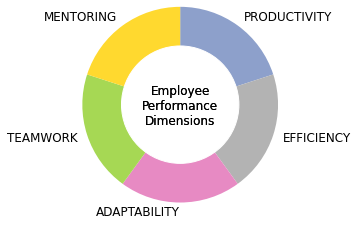

# wlmetrics

Employee performance report from agile worklogs dataset

# 


## Motivation


| DIMENSION    | Nº | KPI            | DESCRIPTION                                                                   |
|:------------:|----|----------------|-------------------------------------------------------------------------------|
| productivity | 1  | velocity       | average number   of hours to complete an assigned task                        |
|              | 2  | concentration  | average length of   time to complete an assigned task                         |
|              | 3  | engagement     | percentage of hours   logged                                                  |
|              | 4  | independence   | percentage of own   work on assigned tasks                                    |
| adaptability | 5  | learning       | percentage of time   spent studying, researching or learning                  |
|              | 6  | versatility    | standard deviation of   the dedication to the different existing projects     |
|              | 7  | heterogeneity  | standard deviation of   dedication to the different existing issue types      |
|              | 8  | complexity     | assumed bugs   resolution rate                                                |
|   teamwork   | 9  | colaboration   | percentage of time   spent collaborating on tasks assigned to other employees |
|              | 10 | sociability    | percentage of   employees with whom they collaborate                          |
|              | 11 | participation  | percentage of time   spent on multi-assigned tasks                            |
|              | 12 | connection     | percentage of time   spent in meetings                                        |
|  mentorship  | 13 | management     | percentage of time   spent on tasks related to planning and organization      |
|              | 14 | guiance        | assumed tasks review   rate                                                   |
|              | 15 | responsibility | average percentage   assumed per project                                      |


## Usage

```python
# read
from preprocess import read_worklogs_files
worklogs = read_worklogs_files()

#  preprocess
from preprocess import preprocess_worklogs
worklogs = preprocess_worklogs(worklogs)

# calculate
from calculate import calculate_metrics_by_year
years = range(2019, 2023)
users_and_metrics = calculate_metrics_by_year(worklogs, years)[0]

# report
from report import generate_reportsworklogs = read_worklogs_files()
year = 2022
history = range(2019, 2022)
generate_reports(users_and_metrics, year, history)

```